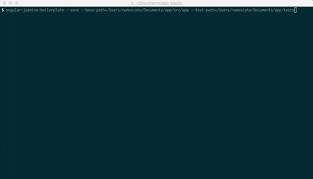

# AngularJS Jasmine Boilerplate Generation [](https://travis-ci.org/namoscato/angular-jasmine-boilerplate)

Generates boilerplate [Jasmine](http://jasmine.github.io/) tests from [annotated](https://github.com/angular/angular.js/wiki/Writing-AngularJS-Documentation) [AngularJS](https://angularjs.org/) components via [Dgeni](https://github.com/angular/dgeni).



    angular-jasmine-boilerplate [--save] [--base-path=path] [--test-path=path] [--config=path] [--non-interactive] [--force] [file ...]

| Option | Type | Description |
|:------ |:---- |:----------- |
| `--save` | boolean | Saves the specified base and test paths to a `config.json` file in the root directory |
| `--base-path` | string | Absolute path to source directory |
| `--test-path` | string | Absolute path to test directory |
| `--config` | string | Path to configuration JSON file |
| `--non-interactive` | boolean | Disables interactive prompt when boilerplate file already exists, and immediately excludes file |
| `--force` | boolean | Forces the boilerplate to be generated, regardless of its previous existence |

## Command-line Interface

1. Install dependencies:

        npm install -g angular-jasmine-boilerplate

2. Save relevant paths:

        angular-jasmine-boilerplate --save --base-path=/dev/project/src --test-path=/dev/project/tests

3. Generate Jasmine boilerplate:

        angular-jasmine-boilerplate session/session.service.js

    where the arguments are one or more paths to annotated AngularJS components, relative to `base-path`.

## Text Editor Packages

This utility is also available for [Sublime Text](https://github.com/namoscato/angular-jasmine-boilerplate-sublime) and [Atom](https://github.com/namoscato/angular-jasmine-boilerplate-atom).

## Supports

* [controllers](https://docs.angularjs.org/guide/controller)
* [services](https://docs.angularjs.org/guide/providers#service-recipe)
* [component controllers](https://docs.angularjs.org/guide/component)

## Features

This utility leverages a handful of conventional [`ngdoc`](https://github.com/angular/dgeni-packages/tree/master/ngdoc) tags to generate boilerplate Jasmine tests.

### `@ngdoc`

Determines the template used to process an item.

When applied to an AngularJS core component, the value of this tag can be `controller`, `service`, or `componentController` to specify a [controller](https://docs.angularjs.org/guide/controller), [service](https://docs.angularjs.org/guide/providers#service-recipe), or [component’s controller](https://docs.angularjs.org/guide/component) respectively.

All public methods with an `@ngdoc` value of `method` generate a  [nested `describe` block](http://jasmine.github.io/2.4/introduction.html#section-Nesting_<code>describe</code>_Blocks) that will ultimately be used to test the particular method in isolation. Private methods not exposed on scope (and without an `@ngdoc` tag) will not have a corresponding `describe` block as they can only be tested via another public method.

### `@name`

Specifies the name of the processed item.

The name of an AngularJS service or controller is used as the title of Jasmine’s outer [`describe` function](http://jasmine.github.io/2.4/introduction.html#section-Grouping_Related_Specs_with_<code>describe</code>).

Names of items that belong to an AngularJS component should be prefixed with the name of that component. For example, a public method `foo` exposed in the service `myService` should include the following annotation:

```js
/**
 * @ngdoc method
 * @name myService#foo
 */
```

This annotated method name is called in the [`beforeEach` function](http://jasmine.github.io/2.4/introduction.html#section-Setup_and_Teardown) of the method’s corresponding `describe` block. This name is also included in a comment above the nested `describe` block.

```js
/**
 * foo
 */

describe('When...', function() {
    beforeEach(function() {
        target.foo();
    });
    
    it('should ', function() {
    
    });
});
```

### `@description`

Specifies the description of the processed method.

The description of an annotated method is used to populate the name of the corresponding nested `describe` block. The first word of a method’s description is expected to be a present tense verb which is ultimately [conjugated](https://github.com/nlp-compromise/nlp_compromise) to a gerund. For example, the description:

```js
/**
 * @description Acts on the specified argument
 */
```

is represented in the generated Jasmine boilerplate as:

```js
describe('When acting on the specified argument', function() {
    ...
});
```

Descriptions that span multiple lines are truncated with an ellipsis.

### `@requires`

Describes the name of an [injected dependency](https://docs.angularjs.org/guide/di).

#### Dependencies

All of the `@requires` tags on a controller or service will generate a set of corresponding [spy objects](http://jasmine.github.io/2.4/introduction.html#section-Spies) that will be used to [mock dependencies](https://docs.angularjs.org/guide/unit-testing#dependency-injection) during the test setup. The local variable names of these spies will be set to the name of the dependency, suffixed with “Spy”. The variable names of [core AngularJS services](https://docs.angularjs.org/tutorial/step_07#-prefix-naming-convention) strip the `$` prefix.

For example, the following controller annotations:

```js
/**
 * @ngdoc controller
 * @name MyCtrl
 * @requires $scope
 * @requires myService
 */
```

will generate:

```js
var scopeSpy;
var myServiceSpy;
...
beforeEach(function() {
    scopeSpy = jasmine.createSpyObj('$scope', ['']);

    myServiceSpy = jasmine.createSpyObj('myService', ['']);
});
```

#### Dependency Methods

A rudimentary regular expression attempts to determine the methods used on each dependency. These methods are included as an alphabetized array of strings, passed to [`jasmine.createSpyObj`](http://jasmine.github.io/2.4/introduction.html#section-Spies:_<code>createSpyObj</code>), creating the spies necessary for testing.

#### Promise API

Additional spy objects will be created for dependency methods that apparently return a [promise](https://docs.angularjs.org/api/ng/service/$q#the-promise-api). For example, the following source code:

```js
myService.fetch().then(function() {
    ...
});
```

will generate:

```js
var myServiceSpy;
...
var myServiceFetchSpy;
...
beforeEach(function() {
    myServiceSpy = jasmine.createSpyObj('myService', ['fetch']);

    myServiceFetchSpy = jasmine.createSpyObj('myService.fetch', ['then']);
    myServiceSpy.fetch.and.returnValue(myServiceFetchSpy);
});
```

This enables testing asynchronous functionality without relying on [`$q`](https://docs.angularjs.org/guide/unit-testing#testing-promises), which requires [manually triggering](https://docs.angularjs.org/api/ng/service/$q#testing) the digest cycle.

```js
describe('...', function() {
    beforeEach(function() {
        target.fetchData();
    });
    ...
    describe('successfully', function() {
        beforeEach(function() {
            myServiceFetchSpy.then.calls.argsFor(0)[0]();
        });
        ...
    });
});
```

### `@module`

Specifies the AngularJS [module](https://docs.angularjs.org/guide/module) in which the controller or service exists.

The value of this tag is included in a `beforeEach` function at the top of the generated boilerplate test:

```js
beforeEach(module('myApp'));
```

### `@component`

Specifies the name of the [component](https://docs.angularjs.org/guide/component) associated with the processed component controller.

The name of the related component is passed as the first parameter to [`$componentController`](https://docs.angularjs.org/api/ngMock/service/$componentController) during the test setup.
